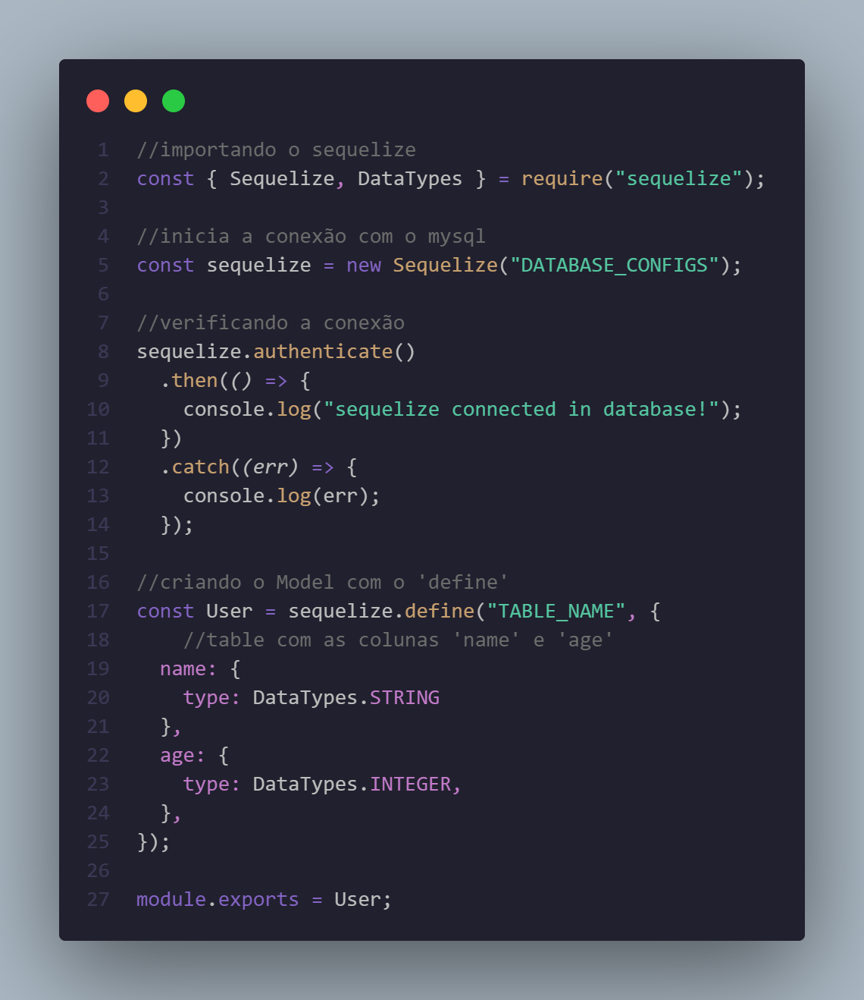

<h1>Study-Sequelize</h1>
<h2>projetos de estudo sobre o ORM Sequelize</h2>
 
<h2>Linha do tempo...</h2>

Use  <code> npm init -y </code>  no seu terminal e depois adcione as dependencias para o projeto: 
<code> npm install express mysql2 sequelize sequelize-cli </code>  
<i>Obs: O mysql2 precisa ser instalado somente para quem vai utilizar o banco mysql. Se você estiver com o postgresql, outra dependencia tem que ser instalada</i>

Crie o seu arquivo <i>server.js</i> dentro da pasta src e faça seu server express nele, junto com as rotas dentro de <i>src/routes/router.js</i>

Dentro de src, crie uma pasta database, e em seguida os arquivos <i>config.js</i> para adicionar suas configurações do banco de dados ao projeto, e <i>connection.js</i> para iniciar a conexão com o banco de dados

Para usar o sequelize-cli no terminal, precisamos passar as configurações do mysql que  estão na pasta <i>src/database/config.js</i>. Então no diretório raiz do projeto crie um arquivo <i>.sequelizerc</i> e mude ele para JavaScript em seguida, assim conseguimos mandar, com o module path, os diretórios das configurações, e o caminho que queremos que ele armazene nossas migrations

Rode no seu terminal, se ainda não estiver criado o banco de dados no mysql, somente no arquivo de configurações da database: <code>npx sequelize db:create</code>. Assim o próprio sequelize vai criar a database de acordo com as configuraçoes do <i>config.js</i> 

Digite o comando <code>npx sequelize migration:create --name nome_da_sua_migration</code> no terminal para o sequelize criar a migration no diretório que você definiu no <i>.sequelizerc</i>. O arquivo que ele criou é usado para criar e fazer alterações no seu banco de dados (como criar uma table, adicionar uma coluna nova em uma table já existente, etc).

Após criar e customizar sua migration, use o comando <code>npx sequelize db:migrate</code> para o Sequelize fazer a tarefa que está no arquivo. Se quiser voltar atrás após ter realizado o comando no terminal, use  <code>npx sequelize db:migrate:undo</code> para desfazer as alterações.

Depois de ter criado sua table no banco de dados, crie o seu model Sequelize de acordo com a table que você fez. Dentro da pasta database, crie uma pasta models e dentro dela faça seu arquivo js com seu model, e importe ele no arquivo de conexão com o banco de dados e pronto, vai poder usar seu model e todas as funções (<i>findAll(); create();destroy(); findByPk(); ect.</i>) que o Sequelize possibilita.

 
<h2>Sequelize model</h2>
<h3>Existem 2 jeitos de fazer um model:</h3>
<ol>
    <li>
        <h3>Define</h3>
        
Após iniciar a conexão com o banco de dados, use o método define, que recebe primeiramente uma string com o nome da sua table, e depois um objeto com as colunas da tabelas do seu banco de dados

         
        
    </li>
</ol>
