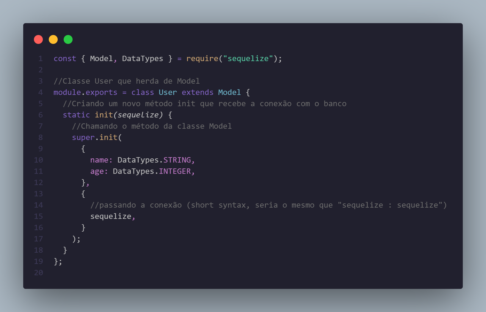
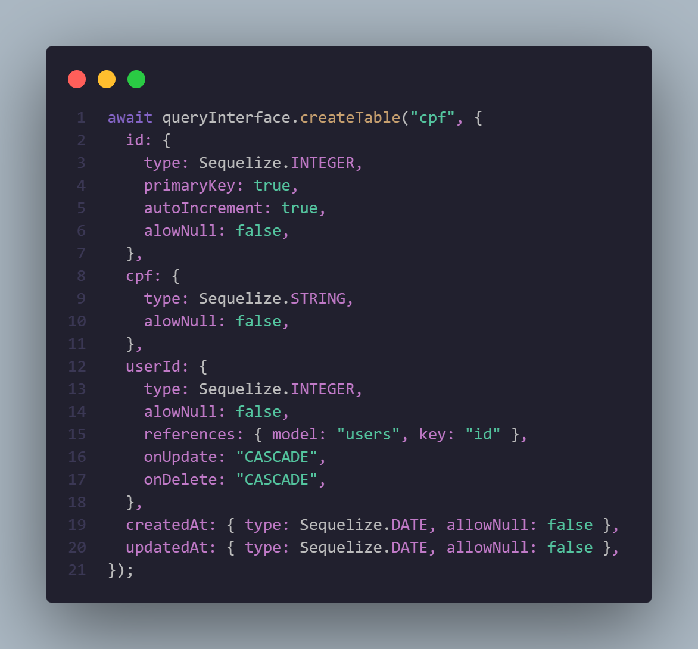
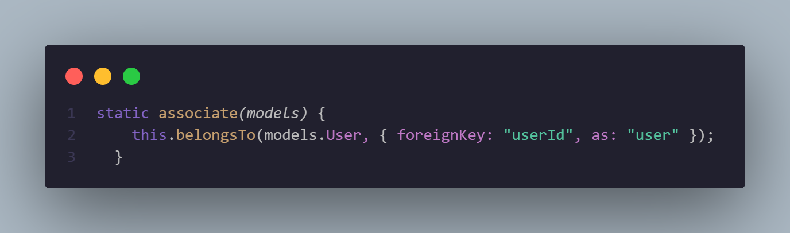
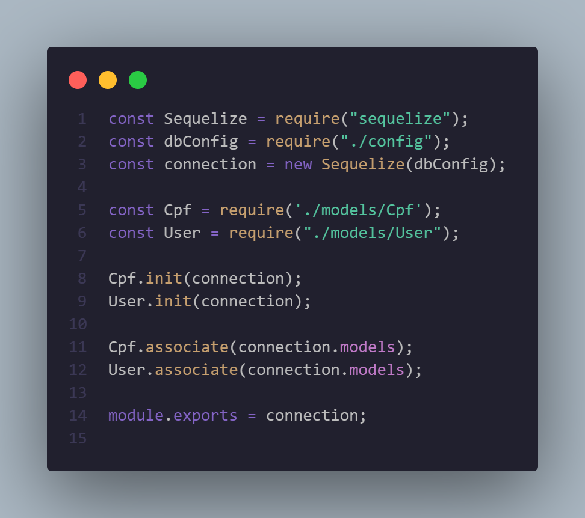
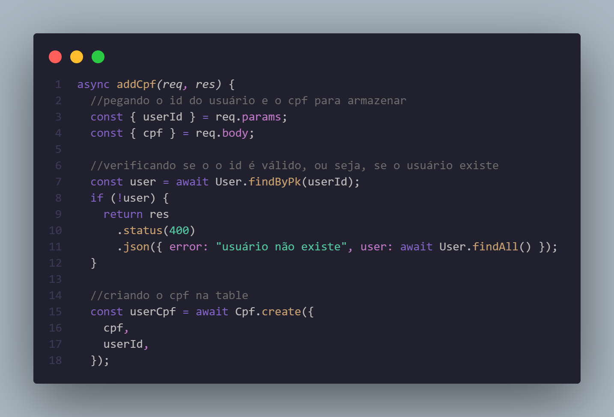
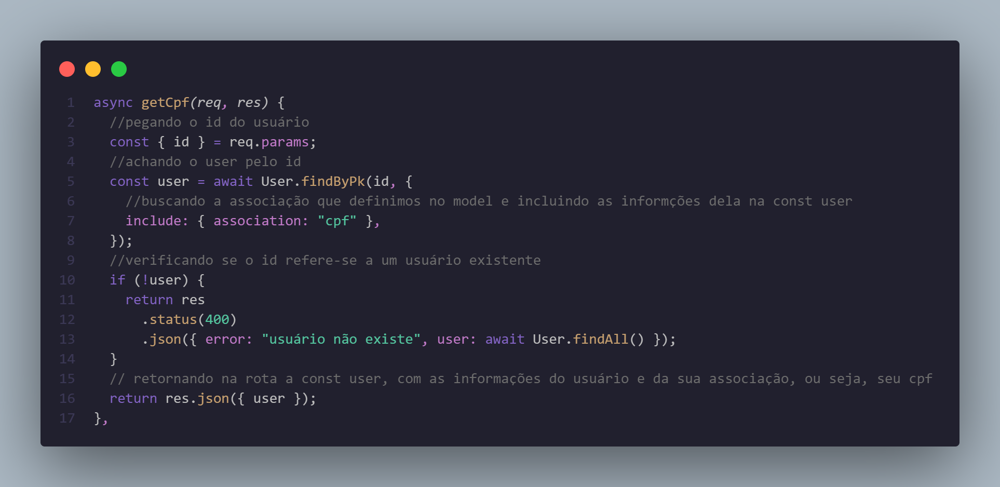
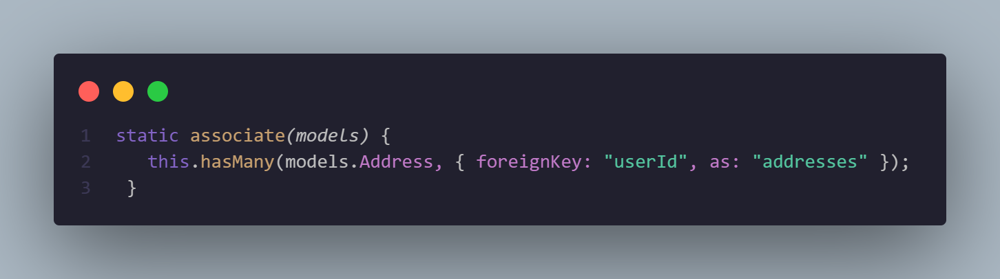

<h1>Study-Sequelize</h1>
<h2>projetos de estudo sobre o ORM Sequelize</h2>
 

Readme status: Em construção...

 

Sumário:

<a href="#functionalities">Funcionalidades || </a>
<a href="#timeline">Linha do tempo || </a>
<a href="#model">Model || </a>
<a href="#association">Associação</a>

 

<h3>Funcionalidades:</h3>
<ul>
<li>Criação de usuários com nome e idade</li>
<li>Listagem e exclusão de usuários</li>
<li>Adicionar, listar e deletar vários endereços de um usuário</li>
<li>Marcar os usuários com <i>tags</i></li>
<li>Deletar tag de um user e listar quais tags tem cada usuário</li>
<li>listar todos os usuários que usam uma determinada tag</li>
</ul>

 

<h2>Linha do tempo...</h2>

Use  <code> npm init -y </code>  no seu terminal e depois adcione as dependencias para o projeto: 
<code> npm install express mysql2 sequelize sequelize-cli </code>  
<i>Obs: O mysql2 precisa ser instalado somente para quem vai utilizar o banco mysql. Se você estiver com o postgresql, outra dependencia tem que ser instalada</i>

<h3>Criando o server</h3>

Crie o seu arquivo <i>server.js</i> dentro da pasta src e faça seu server express nele, junto com as rotas dentro de <i>src/routes/router.js</i>

 
<h3>Fazendo a conexão com o banco de dados</h3>

Dentro de src, crie uma pasta database, e em seguida os arquivos <i>config.js</i> para adicionar suas configurações do banco de dados ao projeto, e <i>connection.js</i> para iniciar a conexão com o banco de dados

 
<h3>Passando as configurações pro sequelize-cli</h3>

Para usar o sequelize-cli no terminal, precisamos passar as configurações do mysql que  estão na pasta <i>src/database/config.js</i>. Então no diretório raiz do projeto crie um arquivo <i>.sequelizerc</i> e mude ele para JavaScript em seguida, assim conseguimos mandar, com o module path, os diretórios das configurações, e o caminho que queremos que ele armazene nossas migrations

 
<h3>Criando uma nova database pro projeto</h3>

Rode no seu terminal, se ainda não estiver criado o banco de dados no mysql, somente no arquivo de configurações da database: <code>npx sequelize db:create</code>. Assim o próprio sequelize vai criar a database de acordo com as configuraçoes do <i>config.js</i> 

 
<h3>Fazendo as migrations</h3>

Digite o comando <code>npx sequelize migration:create --name nome_da_sua_migration</code> no terminal para o sequelize criar a migration no diretório que você definiu no <i>.sequelizerc</i>. O arquivo que ele criou é usado para criar e fazer alterações no seu banco de dados (como criar uma table, adicionar uma coluna nova em uma table já existente, etc).

Após criar e customizar sua migration, use o comando <code>npx sequelize db:migrate</code> para o Sequelize fazer a tarefa que está no arquivo. Se quiser voltar atrás após ter realizado o comando no terminal, use  <code>npx sequelize db:migrate:undo</code> para desfazer as alterações.

 
<h3>Criando o model</h3>

Depois de ter criado sua table no banco de dados, crie o seu model Sequelize de acordo com a table que você fez. Dentro da pasta database, crie uma pasta models e dentro dela faça seu arquivo js com seu model, e importe ele no arquivo de conexão com o banco de dados e pronto, vai poder usar seu model e todas as funções (<i>findAll(); create();destroy(); findByPk(); ect.</i>) que o Sequelize possibilita.

 

<h2>Sequelize model</h2>
<h3>Existem 2 jeitos de fazer um model:</h3>
<ol>
    <li>
        <h3>Define</h3>
        
Após iniciar a conexão com o banco de dados, use o método define, que recebe primeiramente uma string com o nome da sua table, e depois um objeto com as colunas da tabelas do seu banco de dados

         
        
    </li>
     
    <li>
    <h3>Class Model</h3>
    
crie uma classe que herda de Model (<i>extends</i>) e usa o método init dessa classe, que recebe como primeiro parâmetro um objeto com os atributos da sua table, como em define. E depois desse objeto, recebe a sua conexão com o banco, por isso esse método tem que ter um parâmetro pra receber essa conexão.

     
    
     
    
Obs: <i>importe essa classe no arquivo connection.js, para chamar o método init passando a conexão, após isso seu model (User) ja vai poder ser usado junto com todas as funções do sequelize</i>

    </li>
</ol>

 

<h2>Relacionamentos com Sequelize</h2>
<h3>Existem 3 tipos de relacionamentos com banco de dados:</h3>
 
<ol>
    <li>
        <h3>One-to-One (1 para 1)</h3>
        
Ex: uma table users e outra cpfs. Um user só pode <b>possuir</b> 1 cpf, assim como um cpf so pode <b>pertencer</b> a 1 user

         
        
No Sequelize, para fazer um relacionamento desse tipo, é preciso criar, na migration da table <i>'cpf'</i>, além das colunas normais, uma coluna <i>'user_id'</i> que vai <b>referenciar</b> a coluna 'id' da tables de usuários, por isso <code>references: { model: "users", key: "id" }</code>

         
        
         
        
Obs:<i> as keys 'onUpdate' e 'onDelete' são importantes para definir o que vai ser feito com o cpf quando o user for mudado ou deletado. Ao botar o 'CASCADE', você está dizendo que tudo que acontecer com o user deve acontecer com o cpf também, então se um usuário for deletado o seu cpf também será. </i>

         
        
Ao construir o model das tables, você deve criar na classe um método <i>associate</i>, onde vai fazer todas as associações com outras tabelas: 

         
        
         
        
A função <code>belongsTo</code> <i>(pertence á)</i> vai fazer o nosso relacionamento. Como primeiro parâmetro você deve passar o Model que que vai estar associado, então o nosso método vai receber um parâmetro <i>models</i>, que armazena todos os models que estão conectados no seu banco de dados e vamos passar ele no belongsTo seguido do nome do model (nesse caso, como é o model User, passaremos <code>models.User</code> ). Como segundo parâmetro essa função recebe um objeto com as informações da associação: <i>foreignKey</i> que pede o nome da coluna que vai referenciar a outra table, no caso é a 'userId' ; <i>as</i> que pede o nome que vamos dar para essa associação, como ele está referenciando o usuário que tem um cpf vamos chamar de 'user', porém você pode usar qualquer nome nessa chave, só não se esqueça pois vai precisar quando for listar, por exemplo, algum usuário junto com seu cpf.

         
        
No model User também deve ser implementado o método associate, porém nesse caso como um usuário <b>possui 1</b> cpf, então em vez do belongsTo usamos o <code>hasOne()</code>. Assim como no primeiro caso ele recebe o <code>models.Cpf</code> que no caso seria o nosso outro model. E também o objeto com  o nome da coluna que está fazendo a ligação entre os 2 models: <code>foreignKey('userId')</code> e o nome que será dado á essa associação que você está criando: <code>as('cpf')</code>.

         
        
Logo após fazer a associação nos 2 models, precisamos chamar essa função no arquivo de conexão. Então em <i>connection.js</i>, com o User e o Cpf já importados e inicializados (<code>User.init(connection)</code> e <code>Cpf.init(connection)</code>), chame o método em cada model passando a propriedade do Sequelize que tem todos os models que você conectou: <code>User.associate(connection.models)</code> e <code>Cpf.associate(connection.models)</code>

         
        
         
        
Para usar a associação que você fez, como em um caso que você precise armazenar um cpf de um usuário, e mostrar o cpf do usuário que o cliente solicitar:

        
Crie uma rota post no express, que recebe pelo body a string Cpf e pela url (<i>params</i>) o id do usuário que o cpf pertence. Logo ápos, no seu controller e com o model Cpf já importado, faça uma função para criar um novo cpf no banco de dados.

         
        
         
        
Agora com o seu cpf já armazenado no banco, podemos criar uma rota pra listar o cpf de determinado usuário:

        
Crie uma rota do tipo get que como parâmetro na url recebe o id de um user, faça o controller que pega esse userId e ache esse usuário para pegarmos o seu cpf e retornarmos para o cliente. Para isso usamos o objeto <b>include</b>, que basicamente inclui na busca que eu pedi (no caso a de achar um usuário pelo id) algumas informações a mais, e como a gente precisa do cpf além do user, passamos a propriedade <b>associate</b>. Ela recebe uma string que é o nome da associação que definimos lá no model User na chave <b>as:</b> que no caso foi 'cpf'. Isso faz com que além de retornar os dados do usuário que a gente buscou pelo id, o Sequelize retorna o cpf que está associado á ele. 

                
    </li>
    <li>
        <h3>One-To-Many (um para muitos)</h3>
        
Uma tabela de usuários e uma tabela de casas(endereços), ou seja, cada casa refere-se á um usuário, e um usuário pode ser proprietário de várias casas.

        <i>Obs: o exemplo está representado nos arquivos acima (table addresses e table users)</i>
        
Ao criar a migration da tabela de endereços, é necessário criar uma coluna nela que vai referenciar a coluna de 'id' do usuário.
            <code> userId: {  
                type: Sequelize.INTEGER,  
                alowNull: false,  
                references: { model: "users", key: "id" }, 
                onUpdate: "CASCADE",  
                onDelete: "CASCADE",  
                }, 
            </code>            
        

        <i>Coluna 'userId' da tabela de endereços, ela está referenciando a coluna 'id' da table users.</i>
        
Ao definir o model no sequelize, no método associate é preciso usar a função <code>belongsTo()</code>
        no model address, pois um endereço <b>pertence á</b> um usuário. Já no model users é usado <code>hasMany()</code> pois um usuário <b>tem vários</b> endereços.
        <h3>Model address:</h3>
        
         
        <h3>Model User:</h3>
         
         
        

        

            Assim como no relacionamento de 1 para 1, é preciso chamar o método associate no arquivo de conexão, então em <i>connection.js</i> iremos chamar o método assim:
            <code> 
                User.associate(connection.models);  
                Address.associate(connection.models);  
            </code>
        

        
Para explicar como usar na prática essa associação, dentro dos diretórios <i>src/routes/router.js & src/routes/controllers/AddressController.js</i> há um caso com uma tabela de usuários e uma de endereços (um user tem alguns endereços, que por sua vez pertence a um user)

    </li>
    <li>
        <h3>Many-to-Many (muitos para muitos)</h3>
    </li>
</ol>

